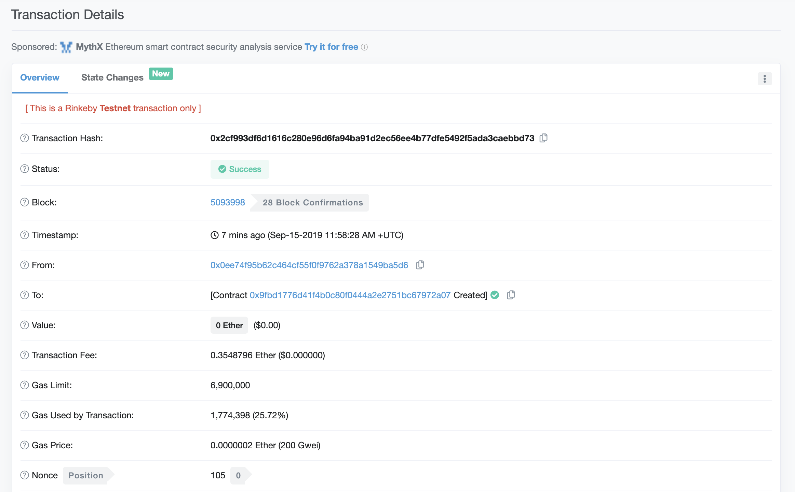
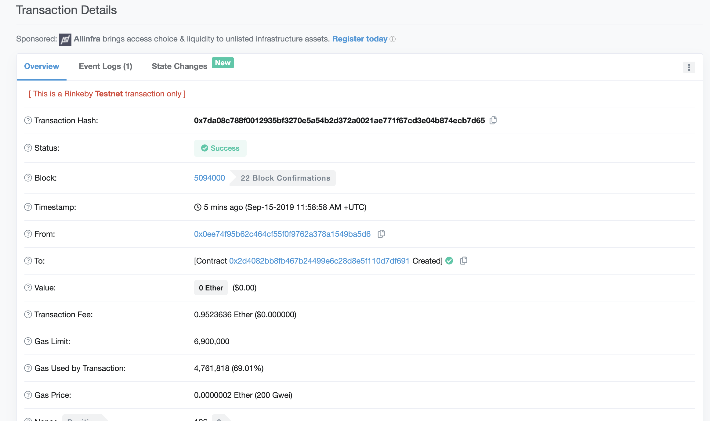
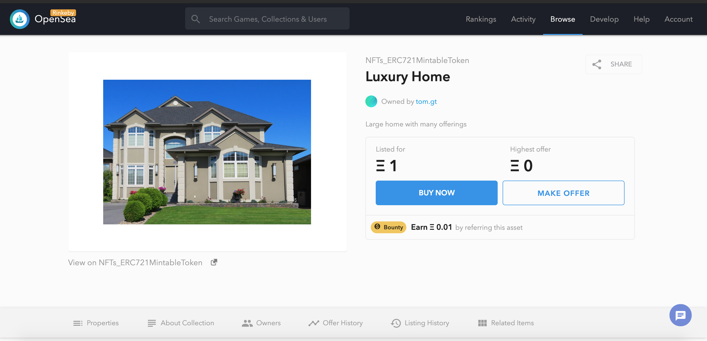
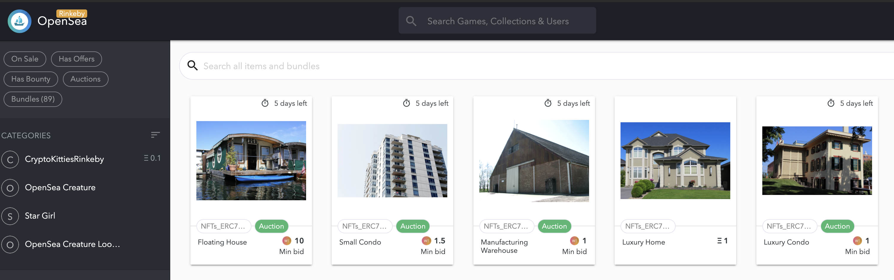
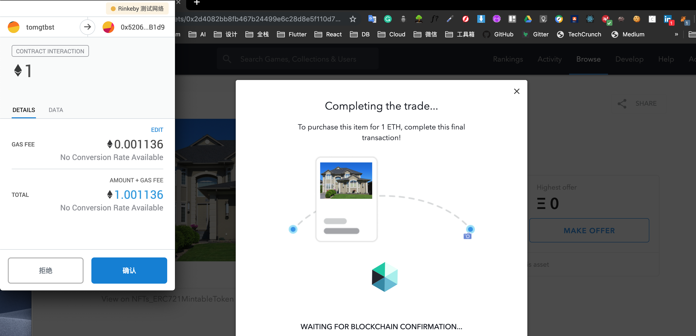
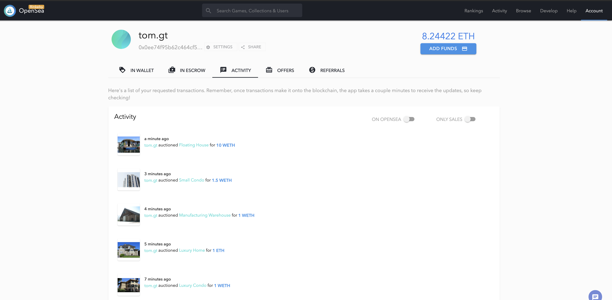
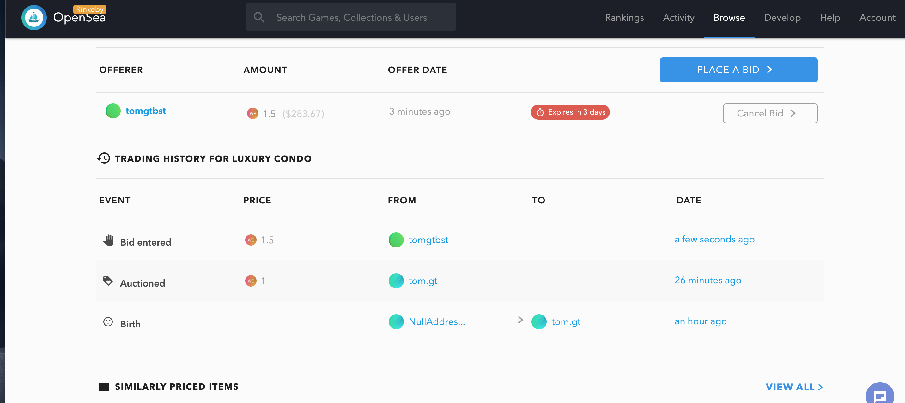

# Real-Estate-Marketplace

Blockchain capstone project of Udacity is Ethereum DApp to build a decentralized housing product.

### Info of project

* Truffle v5.0.20 (core: 5.0.20)
* Solidity v0.5.0 (solc-js)
* Node v10.16.0
* Web3.js v1.0.0-beta.37

### Install dependencies

```
$ sudo npm install --unsafe-perm
```

## Compile 

```
$ truffle compile --all
```

## Test

```
$ truffle Test
```

## Deploy Contract to Rinkeby:

```
$ truffle migrate --reset --network rinkeby
```

### Verifier Smart contract

Contract Address: 0x9Fbd1776d41F4B0C80F0444A2E2751BC67972a07



### SolnSquareVerifier Smart contract

Contract Address: 0x2d4082BB8fb467B24499E6C28D8e5F110D7DF691



### OpenSea marketplace

https://rinkeby.opensea.io/assets/0x2d4082bb8fb467b24499e6c28d8e5f110d7df691/0




https://rinkeby.opensea.io/accounts/0x0ee74f95b62c464cf55f0f9762a378a1549ba5d6










## Versioning

We use [SemVer](http://semver.org/) for versioning. For the versions available, see the [tags on this repository](https://github.com/your/project/tags).

## Built With

* [Ethereum](https://www.ethereum.org/) - Ethereum is a decentralized platform that runs smart contracts
* [IPFS](https://ipfs.io/) - IPFS is the Distributed Web | A peer-to-peer hypermedia protocol
to make the web faster, safer, and more open.
* [Truffle Framework](http://truffleframework.com/) - Truffle is the most popular development framework for Ethereum with a mission to make your life a whole lot easier.

## Authors

* **Tom Ge** - *Fullstack egineer* - [github profile](https://github.com/tomgtqq)

## License

This project is licensed under the MIT License

# Project Resources

* [Remix - Solidity IDE](https://remix.ethereum.org/)
* [Visual Studio Code](https://code.visualstudio.com/)
* [Truffle Framework](https://truffleframework.com/)
* [Ganache - One Click Blockchain](https://truffleframework.com/ganache)
* [Open Zeppelin ](https://openzeppelin.org/)
* [Interactive zero knowledge 3-colorability demonstration](http://web.mit.edu/~ezyang/Public/graph/svg.html)
* [Docker](https://docs.docker.com/install/)
* [ZoKrates](https://github.com/Zokrates/ZoKrates)
